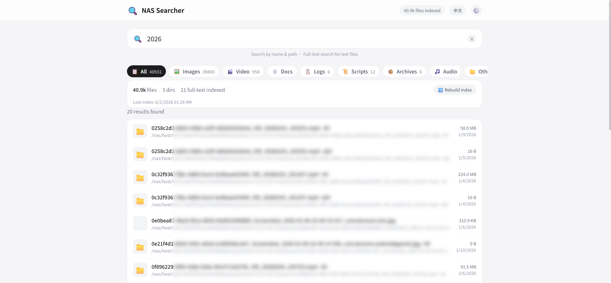
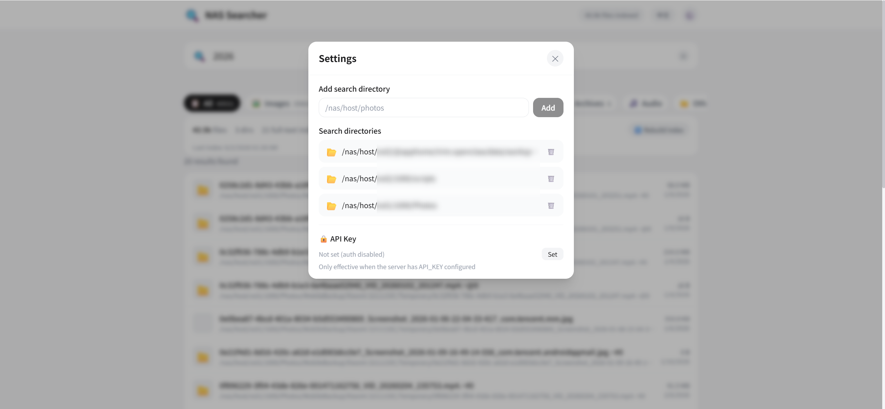

# 🔍 NAS-File-Search

**English** | [简体中文](./README.md)

A Docker-based **NAS global file search tool** with fuzzy filename matching, full-text content search across text files, multi-directory configuration with exclusion filters, and an Apple-style web UI. **Auto-generates image thumbnails**, works on both desktop and mobile browsers. Ships with optional API Key auth, IP rate limiting, and path-traversal protection — safe for public deployment.

## Preview





## Features

### 🔎 File Search
- SQLite-backed fuzzy matching on file name / path, millisecond response
- Whoosh full-text content search covering 40+ text file types (code, config, docs, etc.)
- Highlighted match snippets in results, paginated loading
- LIKE wildcards escaped — searching for `%` or `_` won't cause false matches

### 📁 Multi-Directory Management
- Add / remove search directories from the web UI, with sub-directory exclusion (e.g. `.git`, `node_modules`)
- File size filtering (min / max)
- Thumbnail cache auto-cleaned when a directory is removed

### 🗂️ 8 File Categories
- Images / Video / Documents / Logs / Scripts / Archives / Audio / Other — one-click filter
- Auto stats on file count and space usage per category
- Filtering decoupled from the backend search contract

### 🖼️ Image Thumbnails
- Auto-generated and cached thumbnail previews
- Lazy-loaded on scroll into the viewport
- Decompression-bomb protection (max pixel cap), image extensions only
- Path confined to the mounted subtree — no arbitrary file read

### 📊 Index Progress
- Real-time rebuild progress and the file currently being processed
- Clear progress even with a huge number of files
- Background-thread indexing — search never blocked

### 🌐 Bilingual UI
- Auto-selects Chinese or English based on browser language
- Chinese browsers default to Chinese, others default to English
- One-click toggle in the header, choice remembered locally

### 🔒 Security
- Optional API Key authentication (via env var; empty = disabled)
- IP-based rate limiting against abuse and resource exhaustion
- Path-traversal protection and XSS sanitization — safe for public use

## Usage

### Docker Compose (recommended)

```bash
git clone https://github.com/SpringShaw/NAS-File-Search.git
cd NAS-File-Search
docker compose up -d --build
```

Open `http://localhost:8083`.

> After first launch, add the host directories you want to search in **Settings** (e.g. `/mnt/nas/photos`), then click **Rebuild Index**.

### Local Development

```bash
# Frontend
cd frontend
npm install
npm run dev          # dev server, default port 5173

# Backend
cd backend
pip install -r requirements.txt
uvicorn app.main:app --reload --port 8083
```

## Configuration

| Env var | Default | Description |
|---------|---------|-------------|
| HOST | 0.0.0.0 | Listen address |
| PORT | 8083 | Listen port |
| DATA_DIR | /app/data | Data directory (db, index, thumbnails) |
| API_KEY | (empty) | API Key auth; empty = disabled. Set a long random string for public deploy |
| RATE_LIMIT | 120 | Max requests per IP within RATE_WINDOW; 0 disables |
| RATE_WINDOW | 60 | Rate-limit window in seconds |

In Docker, the host root `/` is mounted read-only into the container at `/nas/host`. Use the original host path when adding directories in the web UI — the app converts it automatically. To narrow the attack surface, replace `/:/nas/host:ro` with a specific sub-directory mount.

## Tech Stack

| Layer | Tech |
|---|------|
| Backend | Python 3.11 + FastAPI |
| Search | SQLite (filename) + Whoosh (full-text) |
| Frontend | Vue 3 + Vite + TailwindCSS |
| Deploy | Docker / Docker Compose |

## API

| Method | Path | Description |
|------|------|------|
| GET | /api/search?q=&type=&page=&size= | Search files |
| GET | /api/stats | Index statistics |
| GET | /api/dirs | List directories |
| POST | /api/dirs | Add a search directory |
| DELETE | /api/dirs/{id} | Remove a directory |
| POST | /api/index/rebuild | Trigger index rebuild |
| GET | /api/index/status | Index progress |
| GET | /api/thumbnail?path= | Get an image thumbnail |
| GET | /api/file-types | Get file category config |

## Highlights

- 🐳 One-command Docker deploy, read-only host mount, zero intrusion
- 🎨 Apple-style clean UI, responsive for desktop and mobile
- 🔒 Data stays local — indexed content never leaves your machine
- 🌐 Bilingual, auto-detects browser language
