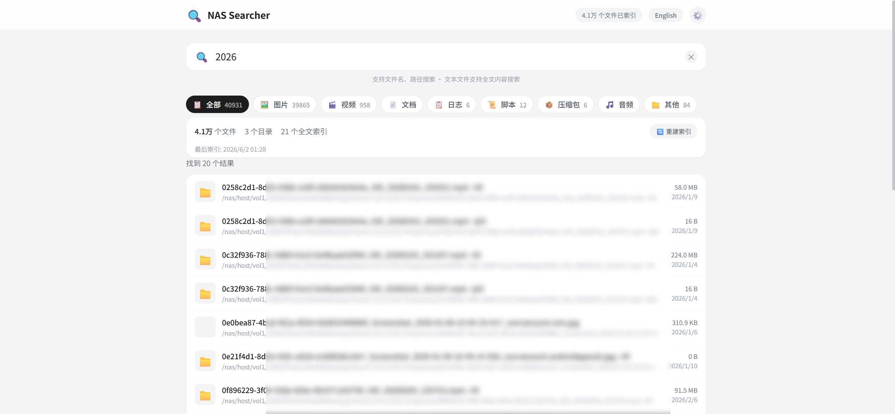
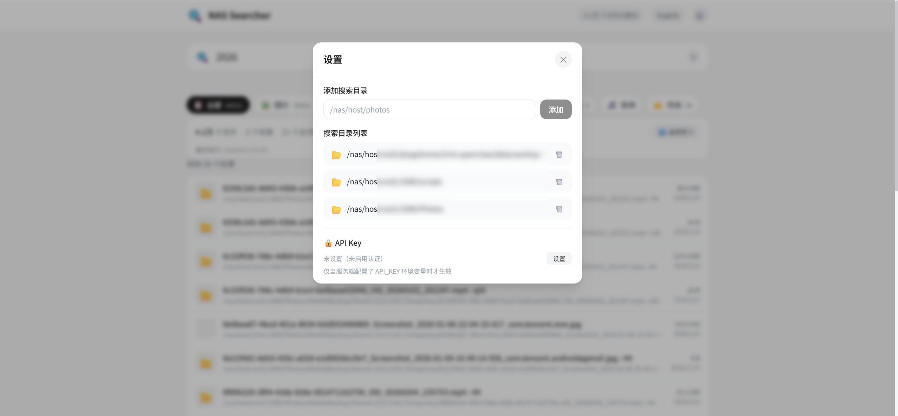

# 🔍 NAS-File-Search

[English](./README.en.md) | **简体中文**

一个跑在 Docker 里的 **NAS 全局文件搜索工具**，支持文件名模糊搜索、文本文件全文内容搜索、多目录配置与排除过滤，自带 Apple 风格 Web 界面，**自动生成图片缩略图**，桌面和手机浏览器都能用。内置可选 API Key 认证、IP 速率限制与路径越界防护，公网部署也安心。

## 界面预览





## 功能特性

### 🔎 文件搜索
- 基于 SQLite 的文件名 / 路径模糊匹配，毫秒级响应
- 基于 Whoosh 的全文内容搜索，覆盖 40+ 种文本文件（代码、配置、文档等）
- 搜索结果高亮匹配片段，分页加载
- LIKE 通配符已转义，搜索 `%` `_` 等字符不会误匹配

### 📁 多目录管理
- Web 界面添加 / 删除搜索目录，支持排除子目录（如 `.git`、`node_modules`）
- 按文件大小过滤（最小 / 最大）
- 删除目录时自动清理对应缩略图缓存

### 🗂️ 8 大文件分类
- 图片 / 视频 / 文档 / 日志 / 脚本 / 压缩包 / 音频 / 其他，一键筛选
- 自动统计各分类文件数与占用空间
- 分类筛选不影响后端搜索契约

### 🖼️ 图片缩略图
- 自动生成并缓存图片缩略图预览
- 懒加载，滚动到可视区才请求
- 防解压炸弹（限制最大像素数），仅允许图片扩展名
- 路径强制限定在挂载目录子树内，杜绝任意文件读取

### 📊 索引进度
- 实时显示重建索引进度与当前正在处理的文件
- 大量文件也能看清进度
- 后台线程构建，不阻塞搜索

### 🌐 中英文界面
- 根据浏览器语言自动选择中文或英文界面
- 中文浏览器默认显示中文，其他语言浏览器默认显示英文
- 顶部一键切换语言，选择记忆在浏览器本地

### 🔒 安全防护
- 可选 API Key 认证（环境变量配置，留空则不启用）
- 基于 IP 的速率限制，防止滥用与资源耗尽
- 路径越界防护与 XSS 消毒，公网部署也安全

## 使用方式

### Docker Compose（推荐）

```bash
git clone https://github.com/SpringShaw/NAS-File-Search.git
cd NAS-File-Search
docker compose up -d --build
```

访问 `http://localhost:8083`。

> 首次启动后在 Web 界面的「设置」中添加要搜索的宿主机目录（如 `/mnt/nas/photos`），再点「重建索引」。

### 本地开发

```bash
# 前端
cd frontend
npm install
npm run dev          # 开发服务器，默认 5173

# 后端
cd backend
pip install -r requirements.txt
uvicorn app.main:app --reload --port 8083
```

## 配置说明

| 环境变量 | 默认值 | 说明 |
|---------|--------|------|
| HOST | 0.0.0.0 | 监听地址 |
| PORT | 8083 | 监听端口 |
| DATA_DIR | /app/data | 数据存储目录（数据库、索引、缩略图） |
| API_KEY | （空） | API Key 认证，留空不启用；公网部署建议设置长随机串 |
| RATE_LIMIT | 120 | 每个 IP 在 RATE_WINDOW 秒内最大请求数，0 禁用 |
| RATE_WINDOW | 60 | 速率限制窗口（秒） |

Docker 部署时，宿主机根目录 `/` 以只读方式挂载到容器 `/nas/host`，Web 界面中添加目录时使用宿主机原始路径即可，程序自动转换。如需收窄挂载范围，可把 `/:/nas/host:ro` 改为挂载具体子目录。

## 技术栈

| 层 | 技术 |
|---|------|
| 后端 | Python 3.11 + FastAPI |
| 搜索 | SQLite（文件名） + Whoosh（全文） |
| 前端 | Vue 3 + Vite + TailwindCSS |
| 部署 | Docker / Docker Compose |

## API 接口

| 方法 | 路径 | 说明 |
|------|------|------|
| GET | /api/search?q=&type=&page=&size= | 搜索文件 |
| GET | /api/stats | 索引统计信息 |
| GET | /api/dirs | 获取目录列表 |
| POST | /api/dirs | 添加搜索目录 |
| DELETE | /api/dirs/{id} | 删除目录 |
| POST | /api/index/rebuild | 触发索引重建 |
| GET | /api/index/status | 索引进度 |
| GET | /api/thumbnail?path= | 获取图片缩略图 |
| GET | /api/file-types | 获取文件分类配置 |

## 特点

- 🐳 Docker 一键部署，宿主机目录只读挂载，零侵入
- 🎨 Apple 风格简洁界面，响应式适配桌面与移动端
- 🔒 数据完全留在本地，索引内容不上传任何服务器
- 🌐 中英文双语，自动识别浏览器语言
